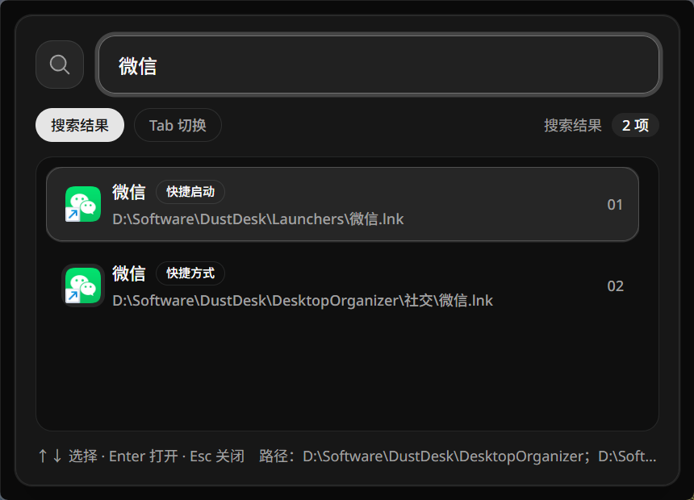
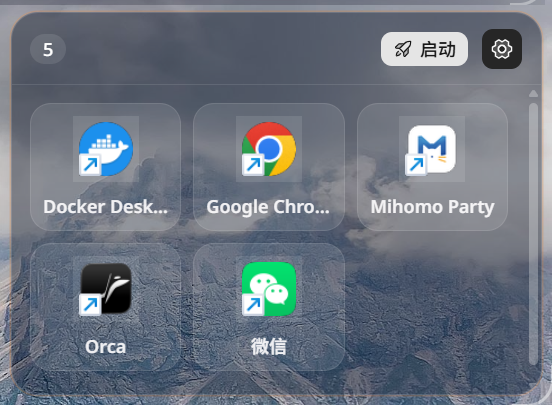
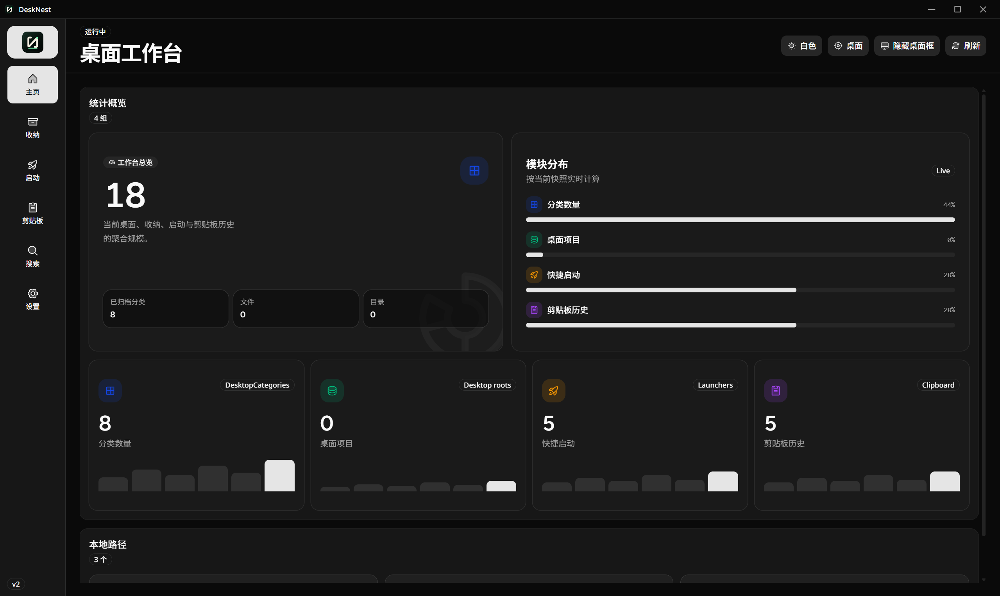
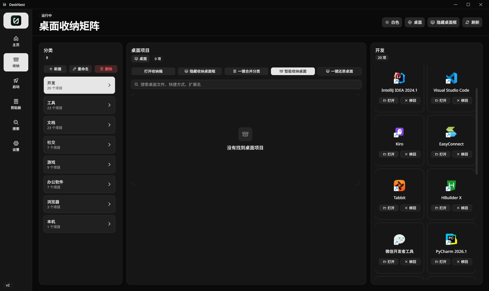
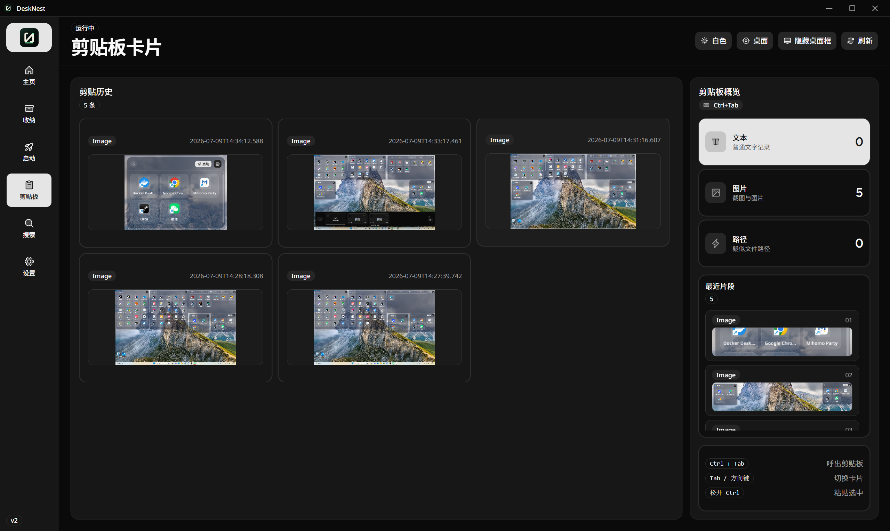

# DustDesk / DeskNest

DustDesk 是一个基于 Tauri 2、React 19、Vite 和 Rust 的 Windows 桌面效率工具。当前功能聚焦在桌面收纳、快捷启动、剪贴板历史、全局搜索和本地数据管理，主界面名称显示为 DeskNest。

## 解决的问题

- 桌面收纳：解决桌面文件、文件夹和快捷方式越堆越多，桌面长期杂乱难整理的问题。
- 全局搜索：解决文件散落在不同目录时，需要到处翻文件夹才能找到文件的问题。
- 快捷启动：解决每次重启电脑后，要反复重新打开多个常用软件、工具和工作文件的问题。
- 剪贴板历史：解决电脑每次只能保留最近一次复制内容，处理多个不同文本和图片时需要来回复制的问题。

## 核心功能

- 桌面工作台：查看本地收纳、快捷启动、剪贴板和搜索历史概览。
- 桌面收纳：按分类管理桌面文件、目录和快捷方式，支持合并桌面框和独立分类卡片。
- 桌面拖拽：桌面项目可拖入收纳箱，收纳箱项目可移回 Windows 桌面。
- 快捷启动：维护常用程序、文件或快捷方式，一键批量启动。
- 剪贴板历史：支持文本和图片历史，`Ctrl+Tab` 呼出卡片式选择；图片粘贴会显示加载状态，避免大图处理时误以为无效。
- 全局搜索：`Ctrl+Space` 呼出搜索框，支持搜索配置路径下的文件、目录、程序和快捷启动。
- 搜索历史：查看搜索历史、最近打开和最常打开列表。
- 目录设置：数据目录、收纳目录和快捷启动目录都可以在设置页自行修改。
- 主题切换：主窗口、剪贴板弹窗和搜索弹窗跟随浅色/深色主题。
- 系统托盘：点击主窗口关闭按钮时缩到托盘后台运行；只有托盘菜单里选择“退出”才真正退出程序。

## 界面截图

### 电脑桌面使用效果






### 程序界面截图







## 行为规则

- 收纳箱是迁移语义：桌面和收纳箱之间同一文件只保留一份，收纳后会移动到 `DesktopOrganizer/<分类名>`。
- 快捷启动是引用/复制语义：桌面拖到快捷启动后，桌面原文件保留，快捷启动只保存自己的入口。
- 快捷启动项不能拖回桌面；移除快捷启动只删除快捷启动入口，不删除桌面或原始文件。
- 托盘隐藏不等于退出：隐藏到托盘时桌面卡片和收纳状态继续保留；从托盘真正退出时会把已收纳项目恢复回桌面。
- 程序启动时会按分类标记重新收纳桌面项目，并校准 `DesktopOrganizer`、`Launchers` 目录中的真实文件。
- 默认数据目录、收纳目录和快捷启动目录会创建在软件安装目录下，分别为 `Data`、`DesktopOrganizer`、`Launchers`。
- 修改数据目录、收纳目录或快捷启动目录时，会创建目标目录并尽量把旧目录内容复制过去；已有同名文件不会被覆盖。
- 桌面卡片和快捷框是桌面辅助窗口，不会置顶遮挡其它软件。
- 剪贴板图片历史以原图路径和缩略图路径保存，预览使用缩略图，粘贴使用原图数据。

## 技术栈

- Tauri 2
- Rust 2021
- React 19
- Vite 6
- Tailwind CSS 4
- shadcn/radix-ui 风格组件
- Zustand

## 快捷键

- `Ctrl+Tab`：呼出剪贴板历史卡片；继续按快捷键或方向键可切换，松开 Ctrl 或按 Enter 粘贴选中项。
- `Ctrl+Space`：呼出全局搜索框。

快捷键可在设置页调整。

## 本地开发

安装依赖：

```powershell
npm ci
```

启动桌面端开发环境：

```powershell
npm run desktop:start
```

这个命令会先停止旧的 DustDesk/Tauri/Vite 开发进程，再启动新的 Tauri 桌面端，适合快速测试完整桌面行为。

只启动前端开发服务：

```powershell
npm run dev
```

生成前端生产构建：

```powershell
npm run build
```

## 常用检查

```powershell
npx tsc -p tsconfig.json --pretty false --noEmit --incremental false
npm run build
Set-Location src-tauri
cargo check
```

如果 Windows 本地环境内存紧张，可以给 Cargo 加 `-j 1`：

```powershell
cargo check -j 1 --manifest-path src-tauri/Cargo.toml
```

## 打包

本地打包 Windows NSIS 安装器：

```powershell
$env:CARGO_BUILD_JOBS="1"
npx tauri build --bundles nsis
```

安装包输出目录：

```text
src-tauri/target/release/bundle/nsis/
```

安装器默认安装目录使用 `DustDesk` 作为产品目录名，并支持安装时选择目录。

## 自动发布

项目包含 GitHub Actions 工作流：

```text
.github/workflows/release-windows.yml
```

当代码合并或推送到 `main` 分支后，工作流会：

1. 在 `windows-latest` 上安装 Node.js 和 Rust。
2. 执行 `npm ci`。
3. 执行 `npx tauri build --bundles nsis`。
4. 创建 GitHub Release。
5. 上传 `DustDesk-<version>-windows-x64-setup.exe`。

如果 Release 创建失败，请到仓库 `Settings -> Actions -> General -> Workflow permissions`，确认已启用 `Read and write permissions`。

## 目录结构

```text
src/                 React 前端源码
src-tauri/           Tauri/Rust 桌面壳源码
public/              前端静态资源
design/              品牌与 Logo 设计资产
scripts/             本地开发脚本
.github/workflows/   GitHub Actions 自动打包发布
AGENTS.md            AI 项目规则和排障经验
```

## 友情链接

- [LINUX DO](https://linux.do/)

## 说明

- `dist/`、`logs/`、`node_modules/`、`src-tauri/target/` 都是本地生成内容，不应该提交。
- 打包发布使用 NSIS `.exe` 安装器，不需要手动上传构建产物。
- 修改 Tauri 窗口、桌面拖拽、剪贴板粘贴等逻辑时，请同步查看 `AGENTS.md` 中记录的 Windows 兼容性规则。
